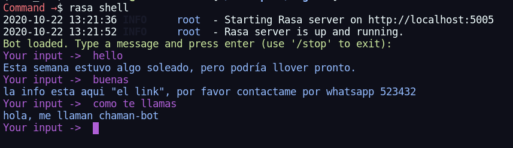

# First steps with rasa-chatbot

An implementation of a basic chatbot that answers questions like, what is your name?, things about the weather or ask for information.

## Run project
[**Rasa**](https://rasa.com/) is a Framework to create chatbots in an easy and comfortable way, and it is written in python3. It requires you to install version [**python3.7**](https://www.python.org/downloads/release/python-378/) para to avoid compatibility problems.

### Requirements
To install Rasa and its dependencies use PIP.
run:
```bash
pip3 install -r requierements.txt
```

if you use a python virtual environment or want to use a python virtual environment you can create an environment with ```pyhon3 -m venv [envName]```.

for example:
```bash
# create enviroment in your project dir or in your envs dir
python3 -m venv rasaenv
# activate env
source rasaenv/bin/activate
# install rasa and dependences
pip install -r requierements.txt
```
### runing chatbot
to run the chatbot you must first train a model.
inside this project folder run:
```bash
rasa train
# for try the chatbot run
rasa shell
```


try introducing "Quiero postular para la vacante de backend" o "Quiero postular para un puesto de trabajo" or a phrase asking to apply for a job.

## Next steps
I will continue learning and adding more complex functionalities to this chatbot

## Autor
* **Willy Samuel Paz Colque** - *All*